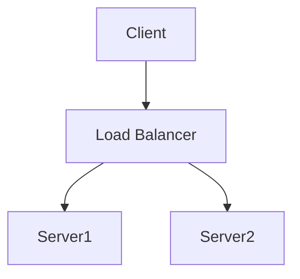

# The-Unix-Workbench
by johns hopkins university on coursera.org. Make date:Tue Out 13 16:26:58 UTC 2020 **Number of lines in guessinggame.sh:**24

[TOC]

- Item 1
  - Sub-item 1
  - Sub-item 2
- Item 2
  - Sub-item 1


## Titles
# Big title (h1)
## Middle title (h2)
### Smaller title (h3)
#### and so on (hX)
##### and so on (hX)
###### and so on (hX)


test|abcd
-----|----
1|1
2|3
2|3
2|3

``` json
{
  "firstName": "John",
  "lastName": "Smith",
  "age": 25
}
```

``` python
import abcd

a = [1,2,3,4]

for i in a:
  print(i)
```



When $a \ne 0$, there are two solutions to $(ax^2 + bx + c = 0)$ and they are 
$$ x = {-b \pm \sqrt{b^2-4ac} \over 2a} $$

$$\lambda = \frac {v}{g}$$

$$\xrightarrow{\text{sample text}}$$

```sequence {theme="hand"}
A->B: Start
B->A: Test1
A->B: Stop
```


$$a = \sin^{2}(\Delta \phi/2) + \cos(\phi_{1})\cos(\phi_{2})\sin^{2}(\Delta \lambda/2)$$
$$c = 2 \arcsin(\sqrt{a})$$
$$d = rc$$


- [x] Write the press release
- [ ] Update the website
- [ ] Contact the media


That is so funny! :joy:


```markdown
inline preprocess : \( E = mc^2 \)
display preprocess: $$ E = mc^2 $$
display preprocess: \[ E = mc^2 \]

```
